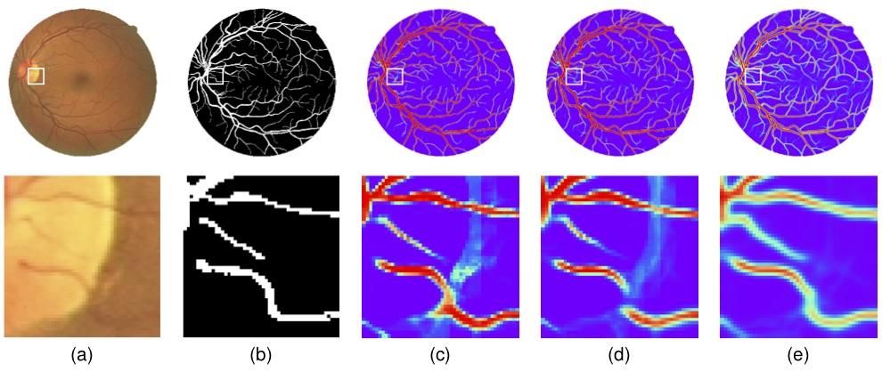
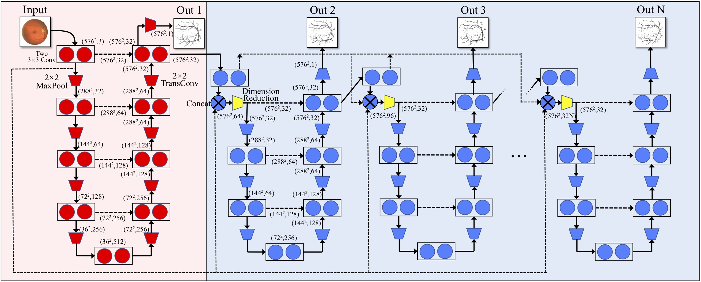
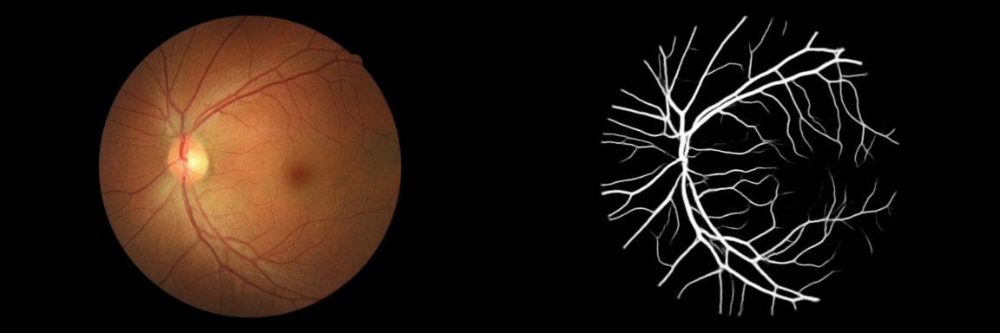
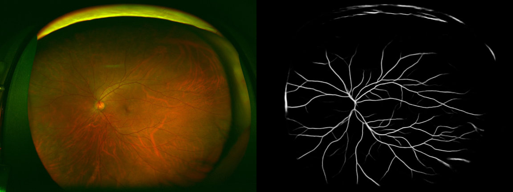

# IterNet

[](https://paperswithcode.com/sota/retinal-vessel-segmentation-on-drive?p=iternet-retinal-image-segmentation-utilizing)
[](https://paperswithcode.com/sota/retinal-vessel-segmentation-on-chase_db1?p=iternet-retinal-image-segmentation-utilizing)

### Update
* We release pre-trained weights.

## Retinal Image Segmentation Utilizing Structural Redundancy in Vessel Networks

Retinal vessel segmentation is of great significance for diagnosis of various blood-related diseases. To further improve the performance of vessel segmentation, we propose IterNet, a new model based on UNet, with the ability to find obscured details of the vessel from the segmented vessel image itself, rather than the raw input image. IterNet consists of multiple iterations of a mini-UNet, which can be 4X deeper than the common UNet. IterNet also adopts the weight-sharing and skip-connection features to facilitate training; therefore, even with such a large architecture, IterNet can still learn from merely 10~20 labeled images, without pre-training or any prior knowledge. IterNet achieves AUCs of 0.9816, 0.9851, and 0.9881 on three mainstream datasets, namely DRIVE, CHASE-DB1, and STARE, respectively, which currently are the best scores in the literature.



Fig.1 IterNet analyzes the vessel network in a retinal image for fine segmentation. The first row is the whole image and the second row is an enlarged image of an area near the bright spot. Red color means a high possibility for a pixel to be part of the vessel while blue color represents a low possibility. We can see that IterNet well handles incomplete details in the retinal image and infers the possible location of the vessels. (a) An example image from the DRIVE dataset, (b) The gold standard, (c) UNet (AUC: 0.9752), (d) Deform UNet (AUC: 0.9778) and (e) IterNet (AUC: 0.9816).

## Model



Fig.2 The structure of IterNet, which consists of one UNet and iteration of (N-1) mini-UNets.

## Usage

Datasets should be placed at `./data/`, related configuration can be modified in `./utils/prepare_dataset.py`.

Training:

```bash
python train.py
```

Prediction:

```bash
python predict.py
```

Models will be placed at `./trained_model/` and results will be saved at `./output/`.

Three examples are given by Jupiter notebooks.

## Pretrained Weights
Here is a model trained with multiple datasets (all images are used for training). Now I am using it for universal retinal vessel extraction. In my test, it works well on new data even with very different brightness, color, etc. In my case, no fine-tunning is needed.

[https://drive.google.com/file/d/1N8Jd_h4FuxbN2-5ElL4FuLQu1Uo3NDuZ/view?usp=sharing](https://drive.google.com/file/d/1N8Jd_h4FuxbN2-5ElL4FuLQu1Uo3NDuZ/view?usp=sharing)

The segmentation results of retinal images from some other datasets.




## Publication

If you want to use this work, please consider citing the following paper.

```
@InProceedings{Li_2020_WACV,
    author = {Li, Liangzhi and Verma, Manisha and Nakashima, Yuta and Nagahara, Hajime and Kawasaki, Ryo},
    title = {IterNet: Retinal Image Segmentation Utilizing Structural Redundancy in Vessel Networks},
    booktitle = {The IEEE Winter Conference on Applications of Computer Vision (WACV)},
    month = {March},
    year = {2020}
}
```

You can find PDF, poster, and talk video of this paper [here](https://www.liangzhili.com/publication/li-2020-iternet/).

## Acknowledgements

This work was supported by Council for Science, Technology and Innovation (CSTI), cross-ministerial Strategic Innovation Promotion Program (SIP), "Innovative AI Hospital System" (Funding Agency: National Institute of Biomedical Innovation, Health and Nutrition (NIBIOHN)).

## License

This project is licensed under the MIT License.